# DIAGRAMAS DE ARQUITECTURA FRONTEND
## Chocolates Costanzo - E-Commerce

**Proyecto:** Sistema de E-Commerce para Chocolates Costanzo  
**Institución:** Universidad Politécnica de San Luis Potosí  
**Versión:** 1.5.0  
**Fecha:** Octubre 2025

---

## ÍNDICE

1. Arquitectura General del Sistema
2. Estructura de Componentes
3. Flujo de Navegación del Usuario
4. Flujo del Sistema de Productos
5. Flujo del Carrito de Compras
6. Flujo de Búsqueda y Filtrado
7. Ciclo de Vida de la Aplicación
8. Integración con APIs Externas
9. Diagrama de Estados del Carrito
10. Estructura de Archivos del Proyecto

---

## 1. ARQUITECTURA GENERAL DEL SISTEMA

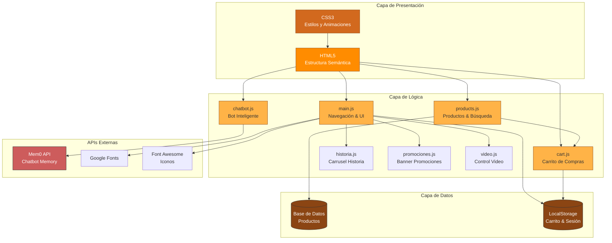

---

## 2. ESTRUCTURA DE COMPONENTES

```mermaid
graph TD
    ROOT[Index.html - Página Principal]
    
    ROOT --> NAV[Navegación Sticky]
    ROOT --> HERO[Hero Slider]
    ROOT --> CAT[Categorías]
    ROOT --> FAV[Favoritos Carousel]
    ROOT --> PROD[Productos]
    ROOT --> PROMO[Promociones Banner]
    ROOT --> HIST[Historia Carousel]
    ROOT --> VIDEO[Video Promocional]
    ROOT --> SOBRE[Sobre Nosotros]
    ROOT --> FAQ[FAQ Accordion]
    ROOT --> CONTACT[Contacto]
    ROOT --> FOOTER[Footer]
    
    ROOT --> CART_SIDE[Cart Sidebar]
    ROOT --> CHATBOT_UI[Chatbot Widget]
    
    NAV --> MENU[Menú Links]
    NAV --> HAMBURGER[Hamburger Mobile]
    NAV --> CART_BTN[Botón Carrito]
    NAV --> ADMIN_LINK[Link Admin]
    
    HERO --> SLIDES[3 Slides]
    HERO --> CONTROLS[Controles Prev/Next]
    HERO --> INDICATORS[Indicadores]
    
    PROD --> SEARCH[Buscador]
    PROD --> FILTERS[Filtros Categoría]
    PROD --> GRID[Grid Productos]
    PROD --> LOADMORE[Cargar Más]
    
    SEARCH --> INPUT[Input Búsqueda]
    SEARCH --> CLEAR[Botón Limpiar]
    SEARCH --> RESULTS_INFO[Info Resultados]
    
    CART_SIDE --> CART_HEADER[Header Carrito]
    CART_SIDE --> CART_ITEMS[Lista Items]
    CART_SIDE --> CART_SUMMARY[Resumen]
    CART_SIDE --> CHECKOUT_BTN[Botón Checkout]
    
    CART_SUMMARY --> SUBTOTAL[Subtotal]
    CART_SUMMARY --> IVA[IVA 16%]
    CART_SUMMARY --> TOTAL[Total]
    
    style ROOT fill:#ff8c00,stroke:#8B4513,color:#fff
    style NAV fill:#FFB347,stroke:#8B4513
    style PROD fill:#FFB347,stroke:#8B4513
    style CART_SIDE fill:#CD5C5C,stroke:#8B4513,color:#fff
    style SEARCH fill:#DAA520,stroke:#8B4513
```

---

## 3. FLUJO DE NAVEGACIÓN DEL USUARIO

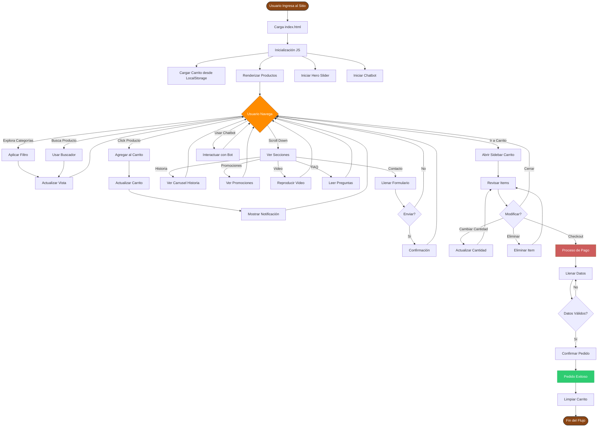

---

## 4. FLUJO DEL SISTEMA DE PRODUCTOS

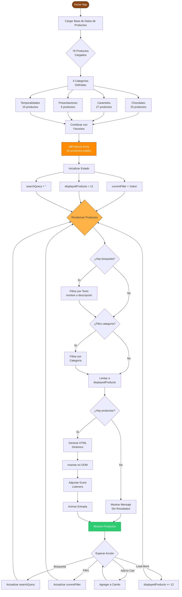

---

## 5. FLUJO DEL CARRITO DE COMPRAS

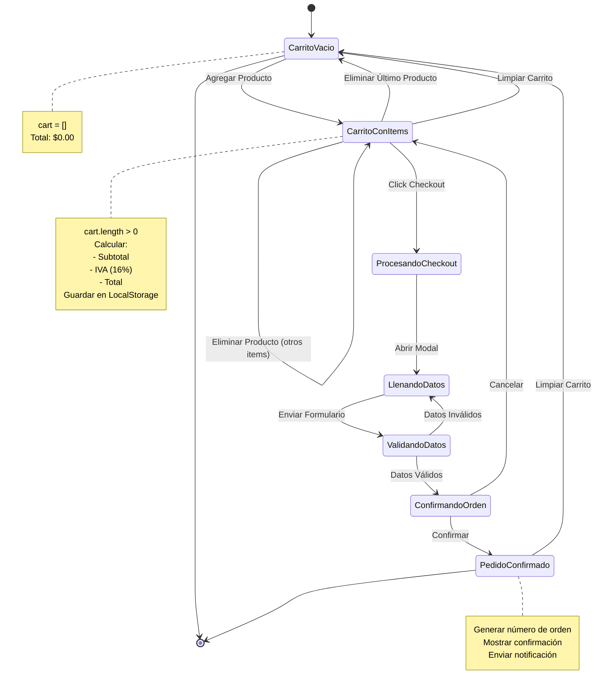

---

## 6. FLUJO DE BÚSQUEDA Y FILTRADO

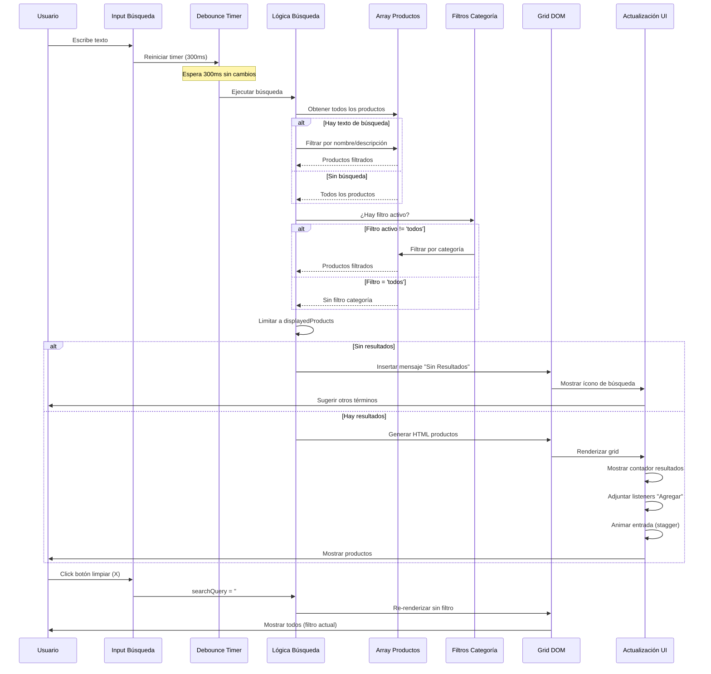

---

## 7. CICLO DE VIDA DE LA APLICACIÓN

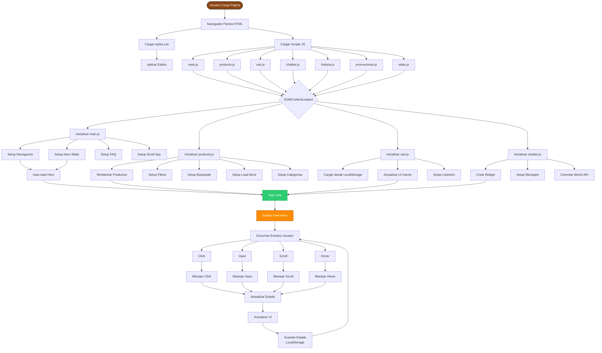

---

## 8. INTEGRACIÓN CON APIs EXTERNAS

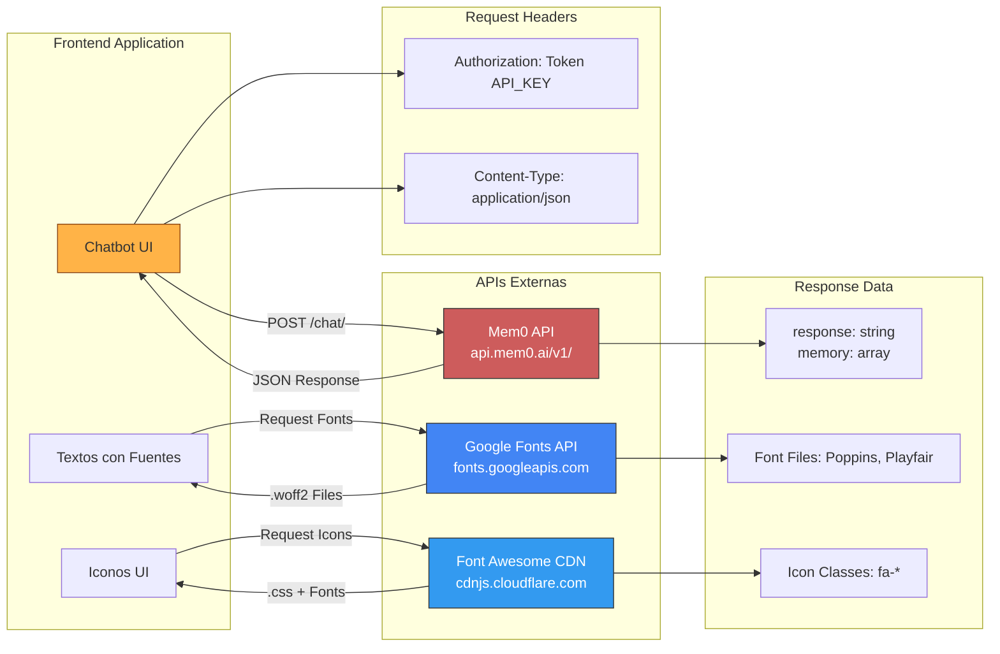

---

## 9. DIAGRAMA DE ESTADOS DEL CARRITO

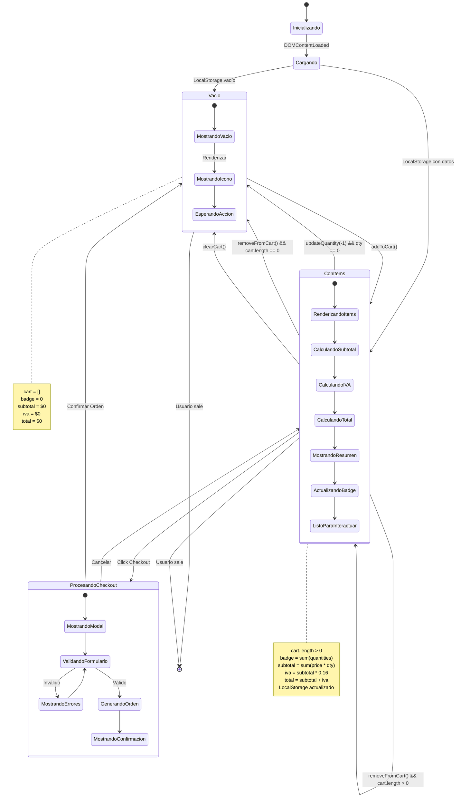

---

## 10. ESTRUCTURA DE ARCHIVOS DEL PROYECTO

```mermaid
graph TD
    ROOT[Comercio-pagweb/]
    
    ROOT --> HTML[index.html]
    ROOT --> CSS_DIR[css/]
    ROOT --> JS_DIR[js/]
    ROOT --> IMG_DIR[img/]
    ROOT --> ADMIN_DIR[admin/]
    ROOT --> DOCS[Documentación]
    
    CSS_DIR --> STYLES[styles.css<br/>2450+ líneas]
    
    JS_DIR --> MAIN_JS[main.js<br/>Navegación & UI]
    JS_DIR --> PRODUCTS_JS[products.js<br/>Productos & Búsqueda]
    JS_DIR --> CART_JS[cart.js<br/>Carrito]
    JS_DIR --> CHATBOT_JS[chatbot.js<br/>Bot]
    JS_DIR --> HISTORIA_JS[historia.js<br/>Carrusel]
    JS_DIR --> PROMO_JS[promociones.js<br/>Banner]
    JS_DIR --> VIDEO_JS[video.js<br/>Video]
    
    IMG_DIR --> CAT1[Caramelos.../]
    IMG_DIR --> CAT2[Chocolates.../]
    IMG_DIR --> CAT3[Piezas.../]
    IMG_DIR --> CAT4[Temporalidades/]
    IMG_DIR --> GENERAL[Imágenes Generales]
    
    CAT1 --> IMG1[30 imágenes]
    CAT2 --> IMG2[23 imágenes]
    CAT3 --> IMG3[8 imágenes]
    CAT4 --> IMG4[11 imágenes]
    
    ADMIN_DIR --> ADMIN_HTML[dashboard.html<br/>login.html]
    ADMIN_DIR --> ADMIN_CSS[admin.css]
    ADMIN_DIR --> ADMIN_JS[admin.js<br/>login.js]
    
    DOCS --> README[README.md]
    DOCS --> DEV_DOC[dev_documentation.txt<br/>1750+ líneas]
    DOCS --> MANUAL[MANUAL_DESARROLLADOR_FRONTEND.md<br/>1460 líneas]
    DOCS --> DIAGRAMS[DIAGRAMAS_ARQUITECTURA_FRONTEND.md<br/>Este archivo]
    DOCS --> INSTRUCTIONS[INSTRUCCIONES_DE_USO.txt]
    DOCS --> CHATBOT_INST[CHATBOT_INSTRUCCIONES.txt]
    
    style ROOT fill:#8B4513,stroke:#333,color:#fff
    style HTML fill:#ff8c00,stroke:#8B4513,color:#fff
    style CSS_DIR fill:#D2691E,stroke:#8B4513,color:#fff
    style JS_DIR fill:#FFB347,stroke:#8B4513
    style IMG_DIR fill:#DAA520,stroke:#8B4513
    style DOCS fill:#2ecc71,stroke:#27ae60,color:#fff
```

---

## 11. FLUJO DE RENDERIZADO DE PRODUCTOS

```mermaid
flowchart LR
    START([Llamar renderProducts])
    
    START --> PARAMS{Recibir Parámetros}
    
    PARAMS --> FILTER_PARAM[filter = 'todos']
    PARAMS --> LIMIT_PARAM[limit = 12]
    PARAMS --> SEARCH_PARAM[search = '']
    
    FILTER_PARAM --> GET_PRODUCTS[products = allProducts]
    LIMIT_PARAM --> GET_PRODUCTS
    SEARCH_PARAM --> GET_PRODUCTS
    
    GET_PRODUCTS --> SEARCH_CHECK{search != ''}
    
    SEARCH_CHECK -->|Sí| SEARCH_FILTER[Filtrar por texto<br/>nombre.includes OR<br/>description.includes]
    SEARCH_CHECK -->|No| CATEGORY_CHECK
    
    SEARCH_FILTER --> CATEGORY_CHECK{filter != 'todos'}
    
    CATEGORY_CHECK -->|Sí| CATEGORY_FILTER[Filtrar por<br/>category == filter]
    CATEGORY_CHECK -->|No| SLICE
    
    CATEGORY_FILTER --> SLICE[Slice 0 to limit]
    
    SLICE --> CHECK_LENGTH{length == 0}
    
    CHECK_LENGTH -->|Sí| NO_RESULTS[HTML = No Results<br/>Icon + Message]
    CHECK_LENGTH -->|No| MAP_PRODUCTS[Map products to HTML]
    
    MAP_PRODUCTS --> TEMPLATE[Template Literal<br/>product-card]
    
    TEMPLATE --> CARD_STRUCTURE[div.product-card<br/>- product-image<br/>- product-overlay<br/>- btn add-to-cart<br/>- product-info]
    
    CARD_STRUCTURE --> JOIN[join array to string]
    
    NO_RESULTS --> INSERT_DOM[grid.innerHTML = html]
    JOIN --> INSERT_DOM
    
    INSERT_DOM --> UPDATE_LOADMORE{products.length > limit}
    
    UPDATE_LOADMORE -->|Sí| SHOW_BTN[Mostrar botón<br/>Load More]
    UPDATE_LOADMORE -->|No| HIDE_BTN[Ocultar botón<br/>Load More]
    
    SHOW_BTN --> ATTACH[Adjuntar Event Listeners<br/>add-to-cart buttons]
    HIDE_BTN --> ATTACH
    
    ATTACH --> ANIMATE[Animar Entrada<br/>Stagger animation<br/>50ms delay cada card]
    
    ANIMATE --> END([Renderizado Completo])
    
    style START fill:#8B4513,stroke:#333,color:#fff
    style END fill:#2ecc71,stroke:#27ae60,color:#fff
    style MAP_PRODUCTS fill:#ff8c00,stroke:#8B4513,color:#fff
    style ANIMATE fill:#FFB347,stroke:#8B4513
```

---

## 12. INTERACCIÓN CHATBOT CON MEM0

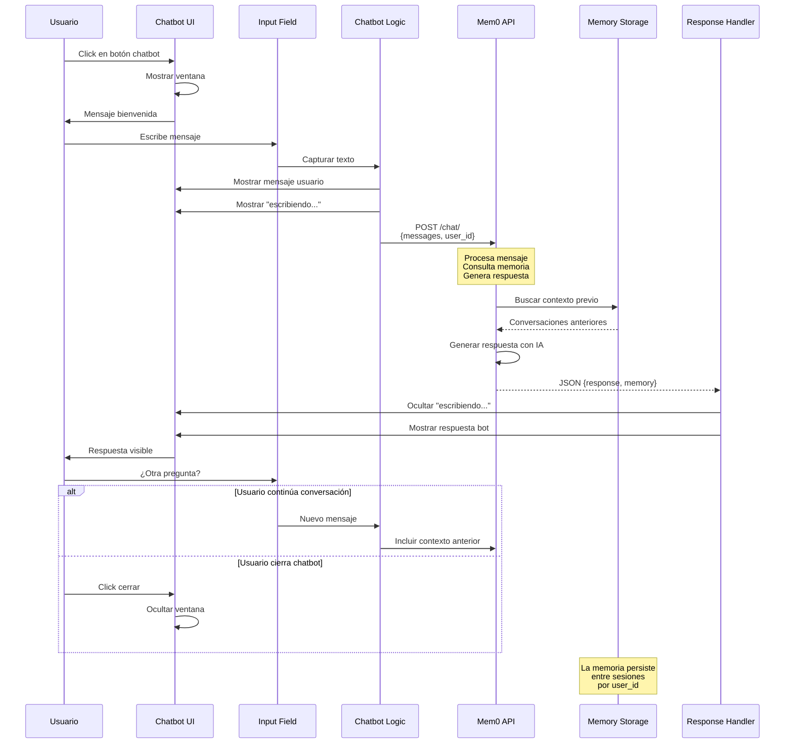

---

## 13. RESPONSIVE DESIGN - BREAKPOINTS

```mermaid
graph TD
    SCREEN[Tamaño de Pantalla]
    
    SCREEN --> LARGE{> 1024px}
    SCREEN --> MEDIUM{768px - 1024px}
    SCREEN --> SMALL{480px - 768px}
    SCREEN --> XSMALL{< 480px}
    
    LARGE --> L_NAV[Nav: Horizontal<br/>Full menu visible]
    LARGE --> L_HERO[Hero: 100vh<br/>Font 4rem]
    LARGE --> L_GRID[Grid: 4 columnas]
    LARGE --> L_CART[Cart: 400px sidebar]
    LARGE --> L_HISTORY[Historia: 2 columnas]
    
    MEDIUM --> M_NAV[Nav: Horizontal<br/>Menu colapsado]
    MEDIUM --> M_HERO[Hero: 80vh<br/>Font 3rem]
    MEDIUM --> M_GRID[Grid: 3 columnas]
    MEDIUM --> M_CART[Cart: 350px sidebar]
    MEDIUM --> M_HISTORY[Historia: 1 columna]
    
    SMALL --> S_NAV[Nav: Hamburger<br/>Fixed sidebar]
    SMALL --> S_HERO[Hero: 70vh<br/>Font 2.5rem]
    SMALL --> S_GRID[Grid: 2 columnas]
    SMALL --> S_CART[Cart: Full width]
    SMALL --> S_HISTORY[Historia: Stack vertical]
    
    XSMALL --> X_NAV[Nav: Hamburger<br/>Full width menu]
    XSMALL --> X_HERO[Hero: 60vh<br/>Font 2rem]
    XSMALL --> X_GRID[Grid: 1 columna]
    XSMALL --> X_CART[Cart: Full screen]
    XSMALL --> X_HISTORY[Historia: Compact]
    
    L_NAV --> DISPLAY[Renderizar Apropiadamente]
    M_NAV --> DISPLAY
    S_NAV --> DISPLAY
    X_NAV --> DISPLAY
    
    style SCREEN fill:#8B4513,stroke:#333,color:#fff
    style LARGE fill:#2ecc71,stroke:#27ae60,color:#fff
    style MEDIUM fill:#3498db,stroke:#2980b9,color:#fff
    style SMALL fill:#f39c12,stroke:#e67e22,color:#fff
    style XSMALL fill:#e74c3c,stroke:#c0392b,color:#fff
```

---

## 14. PERFORMANCE Y OPTIMIZACIÓN

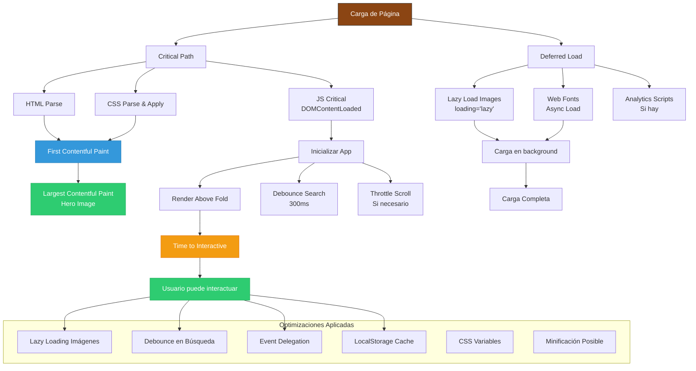

---

## USO DE ESTOS DIAGRAMAS

### Visualización en GitHub
Los diagramas Mermaid se renderizan automáticamente en GitHub, GitLab y otras plataformas.

### Visualización en VSCode
Instalar extensión: "Markdown Preview Mermaid Support"

### Exportar como Imágenes
Usar herramientas como:
- mermaid.live (online)
- mermaid-cli (npm)
- Extensión VSCode con export

### Actualización
Estos diagramas deben actualizarse cuando:
- Se agreguen nuevas funcionalidades
- Cambie la arquitectura
- Se modifiquen flujos principales
- Se integren nuevas APIs

---

**Fin de los Diagramas de Arquitectura Frontend**

Estos diagramas proporcionan una visualización completa de la arquitectura, flujos y componentes del sistema e-commerce de Chocolates Costanzo.

